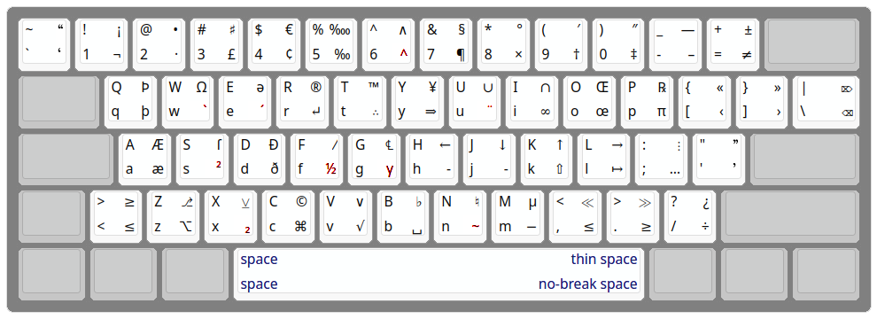
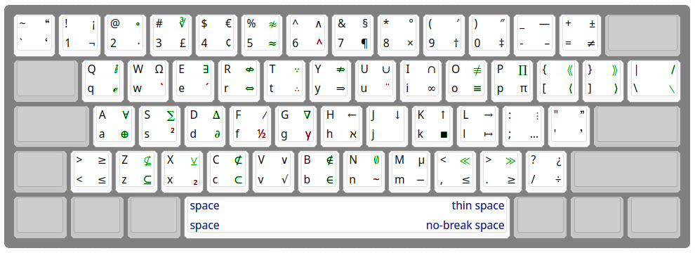

This provides _almost_ the same keyboard layouts under MacOS and \*nix.

## kps(english)



```
┌────┬────┬────┬────┬────┬────┬────┬────┬────┬────┬────┬────┬────┬───────┐
│ ~“ │ !¡ │ @• │ #♯ │ $€ │ %‱ │ ^∧ │ &§ │ *° │ (′ │ )″ │ _— │ +± │       │
│ `‘ │ 1¬ │ 2· │ 3£ │ 4¢ │ 5‰ │ 6^ │ 7¶ │ 8× │ 9† │ 0‡ │ -– │ =≠ │       │
├────┴──┬─┴──┬─┴──┬─┴──┬─┴──┬─┴──┬─┴──┬─┴──┬─┴──┬─┴──┬─┴──┬─┴──┬─┴──┬────┤
│       │ QÞ │ WΩ │ Eə │ R® │ T™ │ Y¥ │ U∪ │ I∩ │ OŒ │ P℞ │ {« │ }» │ |⌦ │
│       │ qþ │ w` │ e´ │ r↵ │ t∴ │ y⇒ │ u¨ │ i∞ │ oœ │ pπ │ [‹ │ ]› │ \⌫ │
├───────┴─┬──┴─┬──┴─┬──┴─┬──┴─┬──┴─┬──┴─┬──┴─┬──┴─┬──┴─┬──┴─┬──┴─┬──┴────┤
│         │ AÆ │ Sſ │ DÐ │ F⁄ │ G℄ │ H← │ J↓ │ K↑ │ L→ │ :⋮ │ "” │       │
│         │ aæ │ s² │ dð │ f½ │ gγ │ h‐ │ j­ │ k⇧ │ l↦ │ ;… │ '’ │       │
├───────┬─┴──┬─┴──┬─┴──┬─┴──┬─┴──┬─┴──┬─┴──┬─┴──┬─┴──┬─┴──┬─┴──┬─┴───────┤
│       │ >≥ │ Z⎇ │ X⊻ │ C© │ V∨ │ B♭ │ N♮ │ Mµ │ <≪ │ >≫ │ ?¿ │         │
│       │ <≤ │ z⌥ │ x₂ │ c⌘ │ v√ │ b␣ │ n~ │ m− │ ,≤ │ .≥ │ /÷ │         │
└───────┴────┴────┴┬───┴────┴────┴────┴────┴────┴───┬┴────┴────┴─────────┘
                   │           space   thinsp       │
                   │           space   nbsp         │
                   └────────────────────────────────┘
```

## kps(math)



```
┌────┬────┬────┬────┬────┬────┬────┬────┬────┬────┬────┬────┬────┬───────┐
│ ~“ │ !¡ │ @∘ │ #∛ │ $€ │ %≉ │ ^∧ │ &§ │ *° │ (′ │ )″ │ _— │ +± │       │
│ `‘ │ 1¬ │ 2⋅ │ 3£ │ 4¢ │ 5≈ │ 6^ │ 7¶ │ 8× │ 9† │ 0‡ │ -– │ =≠ │       │
├────┴──┬─┴──┬─┴──┬─┴──┬─┴──┬─┴──┬─┴──┬─┴──┬─┴──┬─┴──┬─┴──┬─┴──┬─┴──┬────┤
│       │ Qⅈ │ WΩ │ E∃ │ R⇎ │ T∵ │ Y⇏ │ U∪ │ I∩ │ O≢ │ P∏ │ {⟪ │ }⟫ │ |∕ │
│       │ qℯ │ w` │ e´ │ r⇔ │ t∴ │ y⇒ │ u¨ │ i∞ │ o≡ │ pπ │ [⟨ │ ]⟩ │ \∖ │
├───────┴─┬──┴─┬──┴─┬──┴─┬──┴─┬──┴─┬──┴─┬──┴─┬──┴─┬──┴─┬──┴─┬──┴─┬──┴────┤
│         │ A∀ │ S∑ │ D∆ │ F⁄ │ G∇ │ H← │ J↓ │ K↑ │ L→ │ :⋮ │ "” │       │
│         │ a⊕ │ s² │ d∂ │ f½ │ gγ │ hℵ │ j  │ k∎ │ l↦ │ ;… │ '’ │       │
├───────┬─┴──┬─┴──┬─┴──┬─┴──┬─┴──┬─┴──┬─┴──┬─┴──┬─┴──┬─┴──┬─┴──┬─┴───────┤
│       │ >≥ │ Z⊈ │ X⊻ │ C⊄ │ V∨ │ B∉ │ N∅ │ Mµ │ <≪ │ >≫ │ ?¿ │         │
│       │ <≤ │ z⊆ │ x₂ │ c⊂ │ v√ │ b∈ │ n~ │ m− │ ,≤ │ .≥ │ /÷ │         │
└───────┴────┴────┴┬───┴────┴────┴────┴────┴────┴───┬┴────┴────┴─────────┘
                   │           space   thinsp       │
                   │           space   nbsp         │
                   └────────────────────────────────┘
```

## Decoder ring

Dead keys and ambiguous labels:

| Key  |   | EM | Action                 | Mnemonic                    | Note |
|-----:|---|---:|:-----------------------|:----------------------------|------|
| ⌥  - | - | EM | U+2013 en dash         | - for dash                  |      |
| ⌥⇧ - | - | EM | U+2104 em dash         | - for dash                  |      |
| ⌥  6 | ^ | EM | dead circumflex        | Same key as circumflex      |      |
| ⌥  w | ` | EM | dead grave accent      | Beside E                    |      |
| ⌥  e | ´ | EM | dead acute accent      | é is most common in English |      |
| ⌥  u | ¨ | EM | dead diaeresis         | U for umlaut                |      |
| ⌥  s | ² | EM | dead superscript       | S for superscript           | 1    |
| ⌥  f | ½ | EM | dead fraction/compose  | F for fraction              | 2    |
| ⌥  g | γ | EM | dead greek             | G for Greek                 | 3    |
| ⌥  h | - | E- | U+2010 HYPHEN          | H for hyphen                |      |
| ⌥  h | ℵ | -M | dead hebrew            | H for Hebrew                | 4    |
| ⌥  j | - | E- | U+00AD SOFT HYPHEN     | Beside H                    |      |
| ⌥  j |   | -M | U+2062 INVISIBLE TIMES | J for join                  |      |
| ⌥  x | ₂ | EM | dead subscript         | Below S                     | 5    |
| ⌥  n | ~ | EM | dead tilde             | ñ                           |      |
| ⌥  m | - | EM | U+2212 MINUS SIGN      | M for minus                 |      |

- ⌥ = Option or AltGr
- ⇧ = Shift

### Notes

1.  On \*nix, superscripts are implemented using the `<dead_A>` keysym,
    which requires matching `.XCompose` entries, such as those in
    `xkb/compose/superscript`.
2.  On \*nix, AltGr-f is the ‘Compose’ key. On Mac, the layout is hard-coded
    and Option-f provides only fractions.
3.  Dead-key Greek is intended only for occasional use typing mathematics.
4.  Dead-key Hebrew is intended only for occasional use typing mathematics.
    On \*nix, it is implemented using the `<dead_E>` keysym, which requires
    matching `.XCompose` entries, such as those in `xkb/compose/hebrew`.
5.  On \*nix, subscripts are implemented using the `<dead_U>` keysym,
    which requires matching `.XCompose` entries, such as those in
    `xkb/compose/subscript`.
